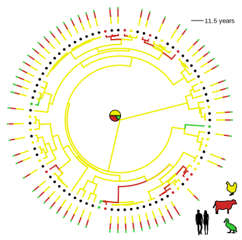
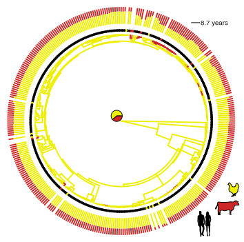
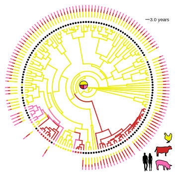
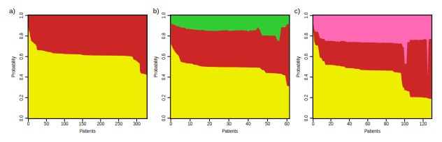

### *Campylobacter*
<br>
* Major cause of bacterial gastroenteritis.
  + Causes severe diarrhoea, vomiting and abdominal pain.
  + Symptoms last 7-10 days.
  + Can lead to more serious diseases such as Guillain-Barré syndrome and reactive arthritis.

<!--- 
this is a comment
--->

---

### Increasing incidence

```{r echo=FALSE, fig.width=9, fig.height=6.5}
par(mar=c(7,8,3.5,3.5))
campycases<-read.table("assets/data/cases2012.txt",header=T)
plot(campycases[,1],campycases[,2],type="l",xlab="",ylab="",las=1,bty="n",lwd=2,cex.axis=1.2,col="blue")
title(ylab="Laboratory reported cases", mgp=c(5,1,0),cex.lab=1.5)
title(xlab="Year", mgp=c(4,1,0),cex.lab=1.5)
```
<div style="font-size:16px">Data source: HPE</div>

---

### Transmission
<br>
* Common transmission routes:
  + Undercooked meat and unpasteurised milk
  + Untreated water
* Human-to human-transmission rare

---


### Zoonosis
<br>
<!--- 
(it is also a zoonotic pathogen, with a wide range of wild and domestic hosts, where it carried, apparently asymptomatically in the gut microbiota)
--->
* Range of wild and domestic hosts
* Asymptomatic carriage in the gut microbiota.
* Contamination can occur any time from farmyard to fork.
<br><br>
<div style="text-align:center">

<div style="font-size:16px;"> &nbsp;<a href="http://www.snap2objects.com/2009/06/9-free-vector-animal-farm/" target="_blank" style="vertical-align:middle">Mauricio Duque</a></span></div>
</div>


--- &vertical

### Characterising zoonosis
<br>
* MLST analyses have shown that:
  + Populations in different host species tend to be genetically isolated, despite shared geography.
  + However, some of the most common disease-causing strains are isolated from multiple host species.

<!---
Because it doesn't survive well outside the gut..., regardless of shared geography.  and this information can be used to attribute the sources of clinical infections by exploiting differences in the Campylobacter strains living in different reservoirs. 
--->

***

### Characterising zoonosis

<br>
<div style="text-align:center">

<div style="font-size:16px;"><a href="http://www.pnas.org/content/110/29/11923" target="_blank" style="vertical-align:middle">Sheppard et al. (2013). PNAS.</a></div>
</div>


<!---
And we can see that with MLST data. Here is a phylogenetic tree from Sheppard et al. 2013, with the coloured circles representing the host species. These single colour clades are phylogenetically distinct. However, these green lines mark 
--->

---
### Characterising zoonosis
<br>
* Genuine generalists?
* Just the limited resolution of MLST?


<!---
Investigating how Campylobacter is able to transmit between host species is fundamental in informing public health strategies and subsequently reducing the current upwards trend in cases.
--->

---

### Aim: 
<br>
To investigate the utility of whole-genome sequences for
<p>
<ul style="padding-left: 60px;">
<li>estimating the rate of zoonosis</li>
<li>improving the accuracy of source attribution for clinical cases</li>
</ul>
</p>
<p style="float:left; padding-left:60px">in these clonal complexes.</p>

--- 

### Challenges
<br>
* Zoonosis model
* Recombination
* Computation 

--- &vertical

### Modelling zoonosis
<br>
* Phylogeography model (Lemey et al., 2009)
* If adapted in the past, would expect isolates from same host population to cluster together.

***

### Phylogeography
<br>
<div style='float:left;width:48%;' class='centered'>
  
  <span style="font-size:16px; vertical-align:bottom"> &nbsp; <a href="http://www.snap2objects.com/2009/06/9-free-vector-animal-farm/" target="_blank" style="vertical-align:middle">Mauricio Duque</a></span>
  <p>Transitions between  hosts</p>
  <p style="font-size:24px">Human = chicken or pig or cattle</p>
</div>
<div style='float:right;width:48%;'>
  
  <span style="font-size:16px"></span>
  <p>Transitions between nucleotides</p>
  <p style="font-size:24px">N = A or C or G or T</p>

<!---
* The ambiguity code will give a posterior probability of each host for each human isolate.
--->

--- 

### Accounting for ancestral recombination
<br>
* Substitution model
  + Relaxed clock
  + Gamma site heterogeneity
* Removal of homoplasies
  + Hedge and Wilson (2014)


---

### ST-45 complex



---

### ST-21 complex



---

### ST-828 complex



---

### Parameter estimates
<br>
Estimated one jump every...
* 1.6 years in ST-21
* 1.8 years in ST-45
* 12 years in ST-828

<!---
rejected single jump hypothesis in all STs
robust to alternative prior beliefs
--->

---

### Parameter estimates
<br>


---

### Source of clinical cases



<!---
89% of cases chicken
consistent with MLST, but still lack in confidence
even when isolates most closely related to clades sampled only from chicken, still uncertainty of 30-40%
--->

---

### Summary
<br>
* Isolates from different host species are often more closely related than those isolated from the same host species. 

* As expected from previous MLST studies, much ancestry is inferred to occur within chickens.
  + MRCA of all three complexes. 

---

### Summary
<br>
* Cannot properly attribute at the individual level in these complexes due to weak host signal.
  + Most likely due to generalist nature of these complexes, and uncertainty reflects make up of host population.
  + Signal could be drowned out or in accessory genome.

* Evidence of potential for whole genomes 
  + BUT the extra information from WGS does not overcome the need for detailed sampling.

---

### Acknowledgements
<br>
Daniel Wilson

Samuel Sheppard

Ben Pascoe

Guillaume Meric

Alison Cody

Simon Frost


<a href='http://www.nature.com/ismej/journal/vaop/ncurrent/abs/ismej2015149a.html' border='0'></a>

---

